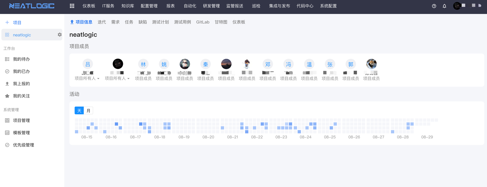
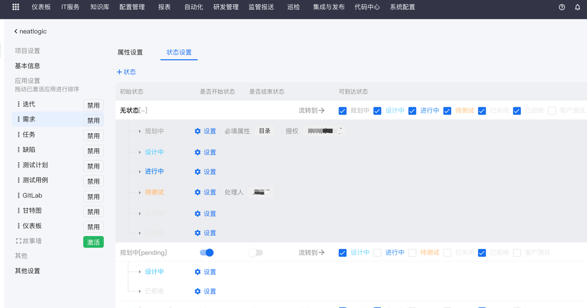
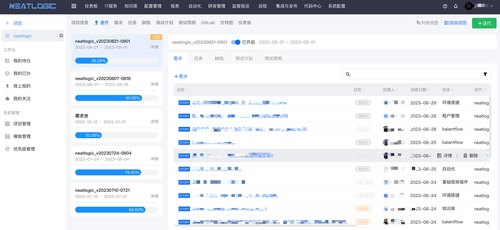
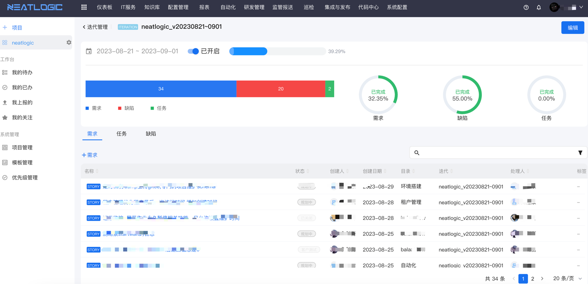
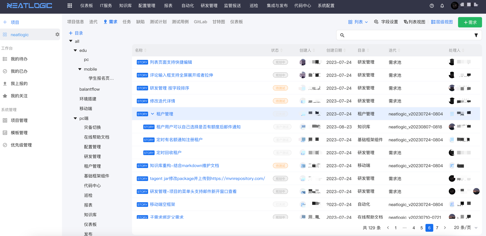
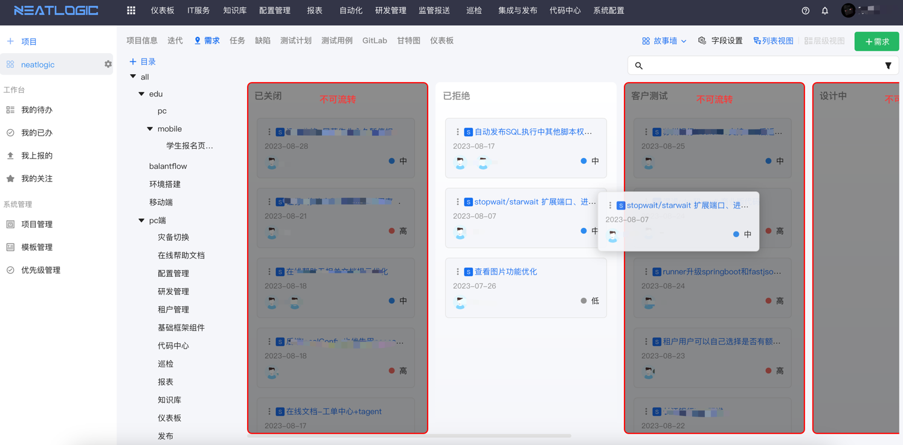
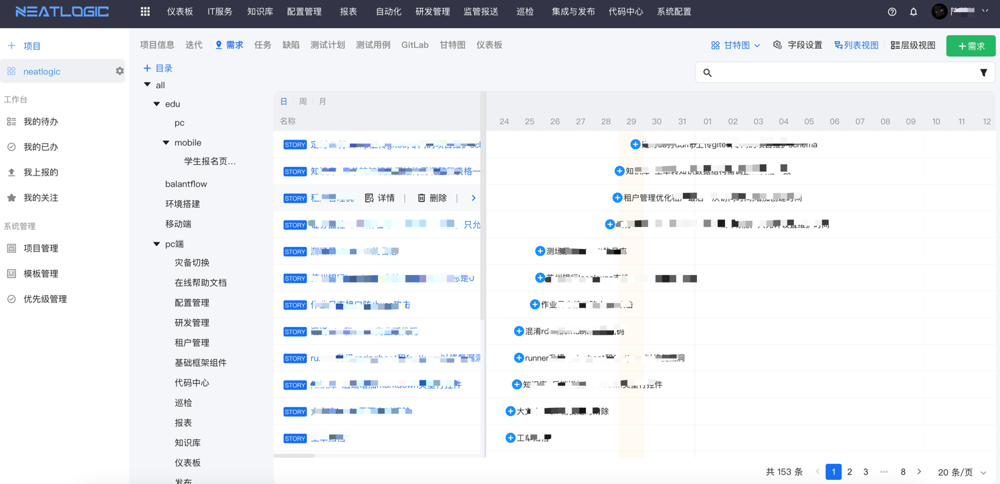
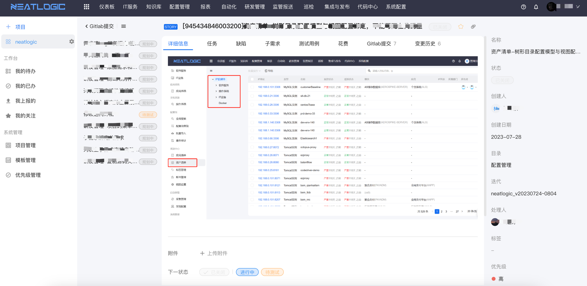

中文 / [English](README.en.md)

    

---

## 关于

neatlogic-rdm是研发管理模块，具备需求管理、缺陷管理、测试用例、测试计划等功能，支持和[neatlogic-deploy](../../../neatlogic-deploy/blob/develop3.0.0/README.md)
和neatlogic-codehub（仅供商业版）进行联动，支持从需求到代码再到版本发布全生命周期管理。

## 主要功能

### 项目管理

项目起始时间、项目成员、项目活动

### 应用管理

用户可根据项目性质自行选择激活不同应用，应用种类数量会随着产品迭代不断扩充，目前社区版支持迭代、需求、任务、缺陷这四个常用应用，商业版进一步支持测试计划、测试用例、Gitlab、甘特图、仪表板和故事板等应用。

- 支持自定义属性。
- 支持自定义状态已经状态流转控制，包括权限控制，必填属性控制等。
- 不同应用有专属的配置页面。

### 迭代

- 迭代以外的应用可根据需要自行选择是否纳入迭代进行管理。

### 需求

- 不限层数父子需求关联。
- 自定义目录。
- 多种视图展示方式（部分视图仅能在商业版使用）。
- 支持修改历史、花费记录、关联代码提交等功能。

## 功能列表

<table>
    <tr>
        <td>编号</td>
        <td>分类</td>
        <td>功能点</td>
        <td>说明</td>
        <td>开源</td>
    </tr>
    <tr>
        <td>1</td>
        <td>系统管理</td>
        <td>项目管理</td>
        <td>管理所有的项目，包括项目基本信息、应用设置，以及结束、删除项目，或把项目保存为新模板。</td>
<td>✅</td>
    </tr>
    <tr>
        <td>2</td>
        <td></td>
        <td>优先级管理</td>
        <td>支持排序，用于需求、缺陷、任务定义紧急程度。</td>
<td>✅</td>
    </tr>
    <tr>
        <td>3</td>
        <td></td>
        <td>模板管理</td>
        <td>支持自定义项目的模板，自定义启停应用设置和排序，自定义应用设置中的属性和状态配置。</td>
<td>✅</td>
    </tr>
    <tr>
        <td>4</td>
        <td>项目</td>
        <td>支持动态管理项目</td>
        <td>项目的应用设置支持动态设置，动态控制项目的成员</td>
<td>✅</td>
    </tr>
    <tr>
        <td>5</td>
        <td></td>
        <td>项目支持迭代计划功能</td>
        <td>包括对迭代的增删改，支持在迭代中配置需求、任务、缺陷、测试计划和测试用例，支持启停迭代。</td>
<td>✅</td>
    </tr>
    <tr>
        <td>6</td>
        <td></td>
        <td>项目可管理需求、任务、缺陷、测试计划等模块。</td>
        <td>支持对项目公共的需求、任务、缺陷、测试计划、测试用例进行增删改操作</td>
<td>✅</td>
    </tr>
    <tr>
        <td>7</td>
        <td></td>
        <td>支持建立需求与任务、缺陷等数据间的互联</td>
        <td>需求详情中可以快速创建或关联任务、缺陷和测试用例，任务、缺陷和测试用例的详情也可以快速关联需求</td>
<td>✅</td>
    </tr>
    <tr>
        <td>8</td>
        <td></td>
        <td>测试计划支持关联测试用例</td>
        <td>测试计划可快速创建或关联测试用例，且支持批量处理测试用例，并跟踪完成度。</td>
<td>❌</td>
    </tr>
    <tr>
        <td>9</td>
        <td></td>
        <td>支持流转处理</td>
        <td>需求、任务、缺陷等状态支持流转并分配新的处理人，直至关闭状态。</td>
<td>✅</td>
    </tr>
    <tr>
        <td>10</td>
        <td></td>
        <td>支持甘特图</td>
        <td>需求、缺陷、任务支持以甘特图查看</td>
<td>❌</td>
    </tr>
    <tr>
        <td>11</td>
        <td></td>
        <td>列表支持字段设置</td>
        <td>所有列表都支持设置字段，包括修改字段的顺序和是否展示。</td>
<td>✅</td>
    </tr>
    <tr>
        <td>12</td>
        <td></td>
        <td>支持按照条件组合过滤列表数据</td>
        <td>列表的数据支持复合搜索，搜索条件包括关键字、优先级、状态、创建日期等。</td>
<td>✅</td>
    </tr>
    <tr>
        <td>13</td>
        <td></td>
        <td>支持查看数据详情并修改</td>
        <td>可查看需求、任务、缺陷等的详细信息，并在详情页面修改数据和关联项。</td>
<td>✅</td>
    </tr>
    <tr>
        <td>14</td>
        <td></td>
        <td>支持关注功能</td>
        <td>可在详情页面关注数据，方便之后快速查看。</td>
<td>✅</td>
    </tr>
    <tr>
        <td>15</td>
        <td></td>
        <td>支持关联代码库，gitlab、github等</td>
        <td></td>
<td>❌</td>
    </tr>
    <tr>
        <td>16</td>
        <td>工作台</td>
        <td>我的待办</td>
        <td>我的待办列表展示所有处理人是当前登录人的需求、任务、缺陷、测试计划和测试用例</td>
<td>✅</td>
    </tr>
    <tr>
        <td>17</td>
        <td></td>
        <td>我的已办</td>
        <td>我的已办列表展示所有当前登录人处理过的需求、任务、缺陷、测试计划和测试用例</td>
<td>✅</td>
    </tr>
    <tr>
        <td>18</td>
        <td></td>
        <td>我的上报</td>
        <td>我的上报列表展示所有创建人是当前登录人的需求、任务、缺陷、测试计划和测试用例</td>
<td>✅</td>
    </tr>
    <tr>
        <td>19</td>
        <td></td>
        <td>我的关注</td>
        <td>我的上报列表展示所有当前登录人已关注的需求、任务、缺陷、测试计划和测试用例</td>
<td>✅</td>
    </tr>
 <tr>
        <td>20</td>
        <td>仪表板</td>
        <td>数据仪表板</td>
        <td>通过图标的方式展示项目相关数据</td>
<td>❌</td>
    </tr>
</table>
